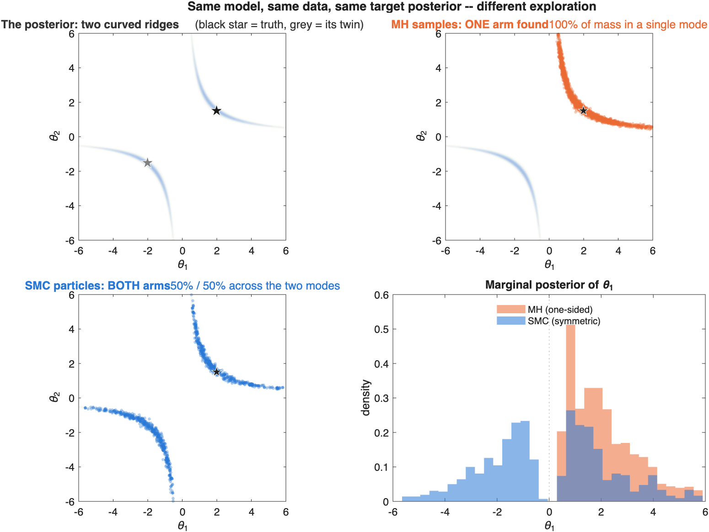

# docs — explaining the estimator

Companion material for how JointSTAR is estimated: what Sequential Monte
Carlo (SMC) is, how it works, and how it differs from the Metropolis–Hastings
(MH) MCMC it replaced. Aimed at a general audience, not just the code.

| File | What it is |
|---|---|
| [`smc_vs_mcmc_slides.html`](smc_vs_mcmc_slides.html) | A short, self-contained slide deck (open in any browser) — the intuition for SMC, a worked toy example, and a side-by-side comparison with MH. No internet or dependencies. |
| [`smc_mh_demo/`](smc_mh_demo/) | A tiny, runnable **MATLAB** demo that samples the same awkward posterior with both methods and shows the difference. Includes an animation and a summary figure. |

## The demo at a glance

`smc_mh_demo/` estimates a two-parameter model whose posterior has a curved,
two-mode ridge — a compact stand-in for the ridge geometry of real macro
"stars" models. Metropolis–Hastings sends one walker and gets stuck in a single
mode; tempered SMC anneals a whole cloud from the prior and covers both. See
[`smc_mh_demo/README.md`](smc_mh_demo/README.md) to run it.

For the full methodology (model equations, likelihood engine, sampler, and
convergence standard) see [`../METHODOLOGY_NOTE.md`](../METHODOLOGY_NOTE.md).
